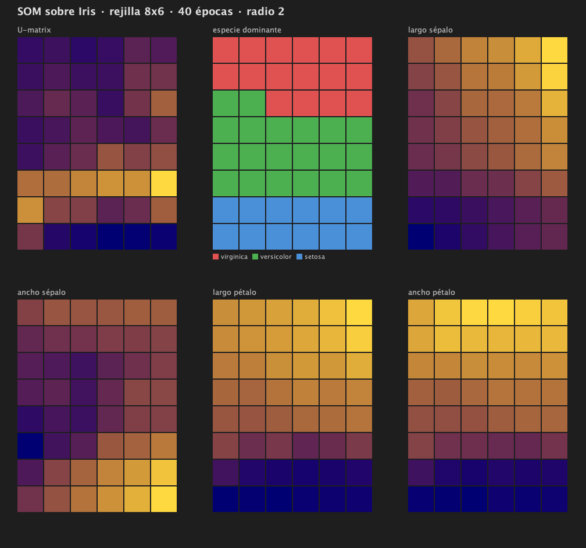
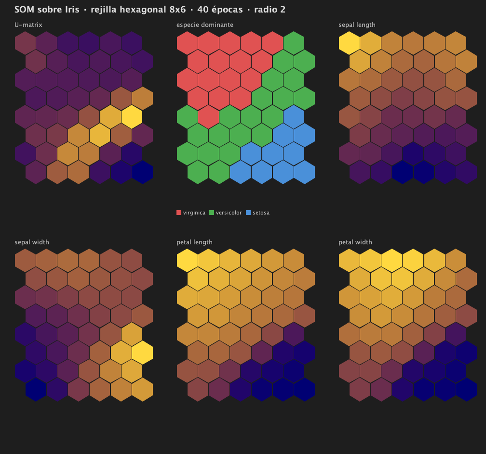

# NeuronaIris

Herramienta de **mapas autoorganizados (SOM)** implementada desde cero en Java, con interfaz JavaFX. Viene con el dataset **Iris** cargado, y acepta cualquier CSV numérico.

Un SOM es una red neuronal no supervisada que proyecta datos de muchas variables sobre una rejilla de neuronas, colocando cerca lo que se parece. Con el Iris se entrena sobre las medidas de 150 flores y el mapa acaba separando solo las tres especies, sin que nadie le diga cuáles son.



## Qué se ve en la imagen

- **U-matrix** — distancia media de cada neurona a sus vecinas. Las zonas claras son fronteras entre grupos. La banda clara cae justo donde *setosa* se separa de las otras dos.
- **Especie dominante** — el mapa se organiza en tres bandas limpias sin haber visto las etiquetas durante el entrenamiento.
- **Planos de componentes** — el valor que aprendió cada neurona para cada medida. Largo y ancho de pétalo salen casi idénticos (están correlacionados) y alineados con el gradiente de especie; el ancho de sépalo sale sin estructura.

## Resultados

**Validación cruzada estratificada de 5 pliegues, repetida 5 veces** (750 evaluaciones), rejilla hexagonal 8×6, 40 épocas:

| | |
|---|---|
| **Acierto sobre datos no vistos** | **95.3 % ± 2.7** |
| Peor pliegue / mejor pliegue | 90.0 % / 100.0 % |
| Error de cuantización | 0.30 |
| Error topográfico | 5.6 % |

Cada muestra se evalúa exactamente una vez por repetición, y cada pliegue conserva la proporción de las tres especies.

Matriz de confusión acumulada:

| real \ predicha | setosa | versicolor | virginica |
|---|---|---|---|
| **setosa** | **250** | 0 | 0 |
| **versicolor** | 1 | 231 | 18 |
| **virginica** | 0 | 16 | 234 |

*Setosa* se separa perfectamente. Casi todos los fallos son entre *versicolor* y *virginica*, que es donde el dataset se solapa de verdad — lo mismo que ya insinuaba la U-matrix.

Para comparar, la estimación por particiones 70/30 repetidas daba 95.9 %: la validación cruzada confirma el número en vez de darlo por bueno.

## Cómo ejecutarlo

Requiere **JDK 19 o superior**. Maven va incluido con el wrapper.

```bash
./mvnw javafx:run
```

Los tests:

```bash
./mvnw test
```

## Cómo empaquetarlo

```bash
JAVA_HOME=/ruta/al/jdk ./scripts/empaquetar.sh
```

Genera `target/instalador/NeuronaIris.app` (~88 MB): una aplicación autocontenida con su propio runtime, que no necesita Java instalado ni el proyecto al lado.

Hace falta un **JDK completo**, con carpeta `jmods` y con `jpackage`. Los runtime que traen algunos IDE (por ejemplo el de Android Studio) son imágenes tipo JRE sin `jmods`, y `jlink` falla con *"Module java.desktop not found"*; el script lo detecta y lo dice. En macOS con Homebrew:

```bash
brew install openjdk@21
JAVA_HOME=/opt/homebrew/opt/openjdk@21/libexec/openjdk.jdk/Contents/Home ./scripts/empaquetar.sh
```

Para un instalador en vez de una carpeta de aplicación, cambia `--type app-image` por `dmg`, `msi` o `deb` en el script.

## Rectangular o hexagonal

La rejilla hexagonal es la que usan las implementaciones de referencia, porque su vecindad es uniforme: las seis vecinas equidistan, mientras que en la rectangular las cuatro de los lados están a distancia 1 y las cuatro diagonales a √2.

Medido sobre 20 semillas, rejilla 8×6, 40 épocas y radio 2:

| | rectangular | hexagonal |
|---|---|---|
| Error topográfico *(vecindad del grafo)* | 16.5 % | **5.6 %** |
| Error topográfico *(celdas que se tocan)* | **3.3 %** | 5.6 % |
| Acierto | 97.3 % | 97.2 % |
| Error de cuantización | **0.281** | 0.300 |
| Neuronas muertas | **5.9 / 48** | 7.5 / 48 |

La lectura importante está en las dos primeras filas. La rectangular solo sale bien parada cuando se le conceden las cuatro diagonales, que su función de vecindad **nunca usa al entrenar**: medida contra su propia topología se va al 16.5 %. En la hexagonal ambas medidas coinciden, porque sus seis vecinas son a la vez las de las aristas y las que se tocan.

A cambio, la hexagonal representa los datos algo peor y desperdicia más neuronas. Viene seleccionada por defecto por coherencia, pero las dos están disponibles.



## Barrido de hiperparámetros

El botón **AUTO-TUNE** sortea 40 configuraciones de épocas, neuronas, radio, tasa de aprendizaje y topología, puntúa cada una por validación cruzada de 5 pliegues y deja la mejor en el formulario. Corre en un hilo aparte para no congelar la interfaz.

Hay dos estrategias implementadas, **parrilla completa** (`buscar`) y **búsqueda aleatoria** (`buscarAleatorio`). La interfaz usa la aleatoria, y la razón está medida:

| presupuesto | mejor acierto *(media de 5 semillas)* | veces que iguala a la parrilla |
|---|---|---|
| parrilla completa — 162 evaluaciones | 98.0 % | — |
| aleatoria — 10 | 97.3 % | 1 de 5 |
| aleatoria — 20 | 97.6 % | 2 de 5 |
| **aleatoria — 40** | **97.9 %** | **4 de 5** |

Con una cuarta parte de las evaluaciones llega prácticamente al mismo sitio. Además la aleatoria explora valores que la parrilla no contempla: la tasa de aprendizaje puede salir 0.37 y no solo 0.3 o 0.5.

Los parámetros importan bastante: sobre el Iris, entre la mejor y la peor combinación hay **casi 7 puntos** de acierto.

| | acierto | configuración |
|---|---|---|
| Mejor | **98.0 % ± 1.6** | hexagonal, 24 neuronas, 40 épocas, radio 2, lr 0.30 |
| Peor | 91.3 % | hexagonal, 48 neuronas, 20 épocas, radio 1, lr 0.50 |

**Ese 98.0 % es optimista y conviene no citarlo como resultado del modelo.** Elegir la ganadora entre 162 candidatas ya usó esos datos, así que parte de la ventaja es haber acertado con el ruido. Medido con evaluación anidada —buscar en una parte y evaluar en otra que la búsqueda no vio:

| | |
|---|---|
| Lo que promete el barrido | 97.7 % |
| Lo que rinde en datos no usados | **96.0 %** |
| Optimismo | **1.7 puntos** |

Por eso la cifra de la sección de resultados sale de validación cruzada con parámetros fijos, no del barrido.

## Cómo se usa la aplicación

1. **START** crea el mapa con los parámetros del formulario: épocas, neuronas, tasa de aprendizaje, radio y **topología** (anillo 1-D, rejilla rectangular o rejilla hexagonal).
2. **TRAIN** lo entrena. Se puede reentrenar para seguir afinando.
3. **2-D MAP** abre la U-matrix, los planos de componentes y las etiquetas del mapa actual. Necesita que la topología sea rejilla.
4. **AUTO-TUNE** busca los mejores parámetros por validación cruzada y rellena el formulario con ellos.
5. **Load Dataset** carga cualquier CSV numérico: la pantalla rehace los campos de entrada, los ejes de las gráficas y la leyenda según sus variables y etiquetas. En `docs/ejemplo-3variables.csv` hay uno de prueba con tres variables. Cada gráfica tiene sus propios desplegables **X** e **Y** para elegir qué par de variables muestra.
6. **Classify** clasifica una muestra introducida a mano; **Load File** clasifica un fichero entero.
7. **Save Map** / **Load Map** guardan y recuperan el mapa entrenado en `~/.neuronairis/mapa.som`, un fichero de texto con la topología, los parámetros y los pesos de cada neurona.

## Cómo está hecho

- **`data.Sample`** — una muestra de N variables con etiqueta. Es la unidad del mapa: tanto los datos como los pesos de cada neurona.
- **`data.Dataset`** — carga cualquier CSV numérico (toma como variables las columnas que parsean a número y como etiqueta la que no), calcula rangos, normaliza, y parte los datos de forma estratificada: en entrenamiento/prueba (`split`) o en k pliegues de validación cruzada (`kFold`).
- **`SOM`** — el mapa. Tres topologías: anillo 1-D, **rejilla rectangular** (4 vecinas) y **rejilla hexagonal** (6 vecinas, filas impares desplazadas media celda). La vecindad se calcula con un recorrido en anchura sobre el grafo, así que la distancia es el número de saltos y funciona igual en las tres.
- **`SOMNeuron`** — una neurona; sus pesos viven en el mismo espacio que los datos.
- **`data.SOMAnalysis`** — U-matrix, planos de componentes, error topográfico, matriz de confusión.
- **`data.BusquedaHiperparametros`** — parrilla de combinaciones y muestreo aleatorio de un espacio de rangos, con el barrido puntuado por validación cruzada.
- **`ui.MapaView`** — la ventana del mapa, construida con contenedores y un `Canvas` que se redibuja al redimensionar.

La pantalla principal usa `BorderPane` + `GridPane` + `FlowPane`: las gráficas se reparten el espacio, el panel lateral mantiene su ancho y los controles bajan de línea si la ventana se estrecha. Los campos de entrada, los desplegables de ejes y la leyenda se construyen en tiempo de ejecución a partir del dataset cargado. Lo dibujado se guarda en capas, de modo que cambiar un eje repinta la gráfica sin tener que reentrenar. El panel inferior derecho muestra el carrusel de fotos con el Iris y la distribución de muestras por etiqueta con cualquier otro dataset. El Iris viaja dentro del jar y el estado de la aplicación (mapas guardados) se escribe en `~/.neuronairis/`.

El grafo sobre el que se apoya el mapa es la librería `cu.edu.cujae.ceis.graph` de la CUJAE, incluida en el árbol de fuentes.

`Flower` sobrevive como vista con nombres (`getPetalLength()`…) sobre `Sample`, porque la interfaz lee las medidas del Iris por nombre.

## Estado y limitaciones

- El radio de vecindad puede encogerse con las épocas (`setShrinkRadius`), pero viene **desactivado**: medido sobre 20 semillas mejora siempre el error de cuantización y da resultados mixtos en el topográfico.
- La normalización min-max existe pero no se aplica por defecto. En Iris no mejora el acierto porque el largo del pétalo —que domina la distancia con un 70 %— es justo la variable discriminante. En otro dataset conviene activarla.
- La búsqueda aleatoria sortea a ciegas: no aprende de lo ya probado. Una búsqueda bayesiana concentraría el presupuesto en las zonas prometedoras.
- El barrido usa validación cruzada simple; la evaluación anidada, que es la que da la cifra honesta, está en los tests pero no en la interfaz.

## Autoría

Trabajo de la asignatura de Estructuras de Datos de la **CUJAE** (2024), hecho en equipo por **Ruben Frias**, **Fabián Fernández**, **Clari21** y **MrKettleburn**. La mayor parte del código original —incluido el núcleo del SOM y la interfaz— es de Ruben Frias.

En 2026 Fabián retomó el proyecto para terminarlo, porque la última versión del equipo nunca llegó a subirse. De ese trabajo posterior salen: el desacoplamiento del dataset, la topología en rejilla, las lecturas del mapa, la evaluación con validación cruzada y la batería de 92 tests, además de arreglar varios fallos del código original (las imágenes se cargaban desde rutas absolutas de una máquina concreta, reentrenar corrompía el agrupamiento y la clasificación podía entrar en un ciclo infinito).

## Dataset

[Iris](https://archive.ics.uci.edu/dataset/53/iris) — R. A. Fisher, 1936. 150 muestras, 4 medidas, 3 especies.
